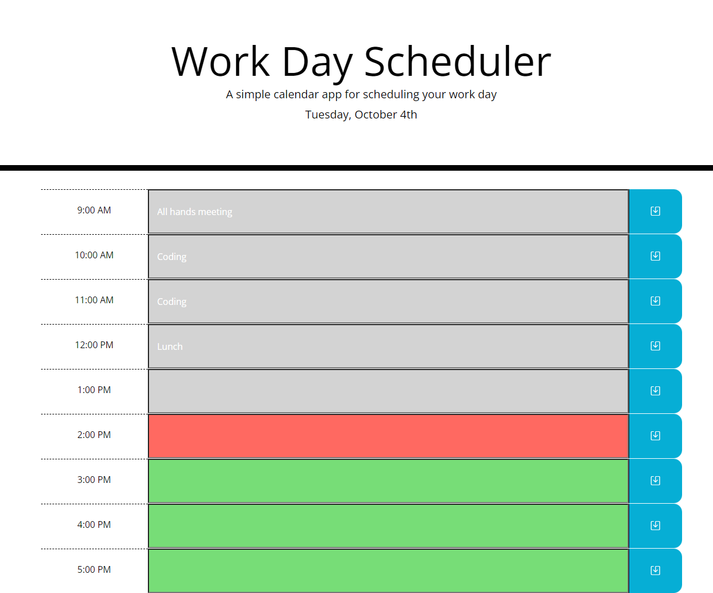

# Project 5 - Daily Planner
In the project I created the JavaScript functions to save, store, and render a daily planner. The application meets the following requirements:
* The current date is displayed at the top of the application
* The planner presents time blocks for regular business hours
* The time blocks are color coded to indicate past, present, and future
* Clicking on a time block allows the user to enter text
* Clicking on the save button will save the text to local storage
* The saved text will render to the page on reload
---

## Where to Find It
The application is deployed [here](https://pikaypi.github.io/daily-planner/).

---
## What It Looks Like

---
## How It Works
When the user clicks the save icon, any text entered into the input area for that time block will be saved to local storage and rendered any time the page loads until it is saved over.